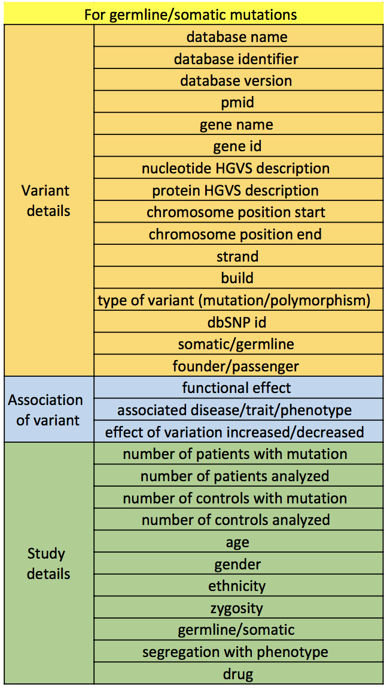
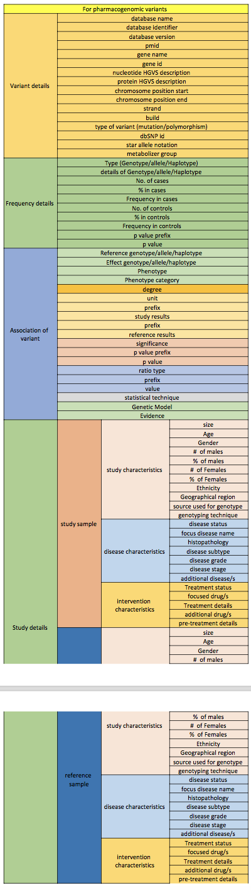
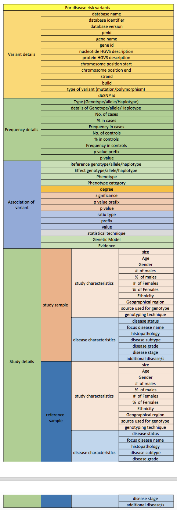

.. _mapping:

Field Mapping
!!!!!!!!!!!!!

This section describes some of the field mapping needed as we build out our data landscape and map to common canonicals. You can find a more complete mapping and additional data in `This google doc <https://docs.google.com/spreadsheets/d/1N_COYHlBvxmiNnO4CC2lypHJ2NkfYzdSwDrqKeC4fg0/edit#gid=1267357957>`_

* Mutations

* Pharmacogenomics

* Disease risk

